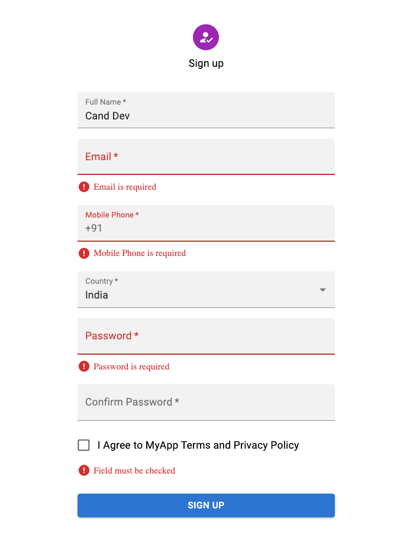

This project was bootstrapped with [vite](https://vitejs.dev/guide/#scaffolding-your-first-vite-project).

<ins>Signup Preview</ins>

## Available Scripts

In the project directory, you can run:

### `npm install`

Instal All dependencies in this project

### `npm run dev`

Runs the app in the development mode. 
Open [http://127.0.0.1:5173](http://127.0.0.1:5173) to view it in the browser.

### Link

- Vite - https://vitejs.dev/guide/#scaffolding-your-first-vite-project
- Material UI - https://mui.com/material-ui/react-checkbox/
- React-Hook-Form - https://react-hook-form.com/get-started/#SchemaValidation
- API - https://restcountries.com/#api-endpoints-v3-all
- Regex - https://gist.github.com/candraKriswinarto/b397cf5c503e6f7969b5784a2840293c

### Video Tutorial

You can see my youtube video for this project in [here](https://youtu.be/3uEyy_f81r0)
